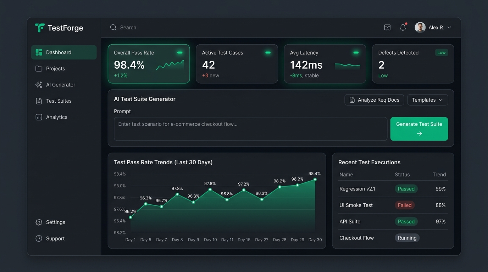
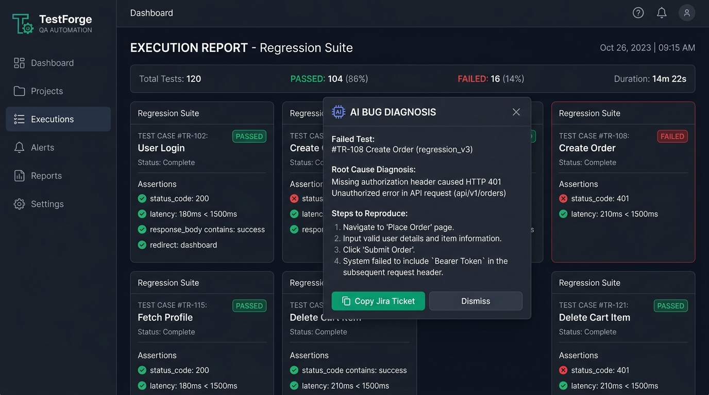
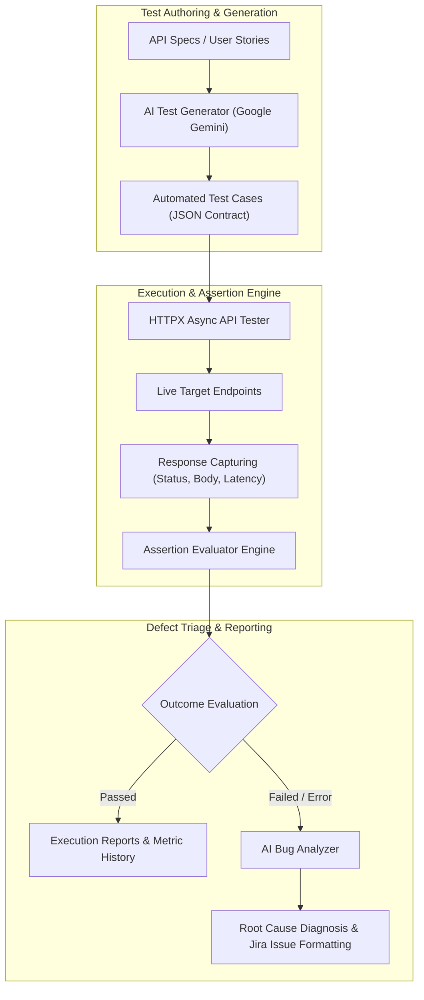

# TestForge: AI-Powered Software Testing & QA Automation Platform

<p align="center">
  
</p>

**TestForge** is an enterprise-grade AI software testing and QA automation ecosystem designed to bridge manual specification with autonomous test generation, multi-method HTTP execution, and root-cause defect triage.

TestForge generates comprehensive API test suites directly from user stories and endpoint specifications, executes tests concurrently with millisecond SLA tracking, performs deep JSON assertion verification, and uses **Google Gemini** to diagnose failures into actionable Jira defect tickets.

---

## 📸 Interface Preview

| QA Automation Dashboard | Test Execution Reports & AI Defect Triage |
| :---: | :---: |
|  |  |

---

## 🌟 Key Features

- **Automated API Tester**: Concurrent execution across `GET`, `POST`, `PUT`, `DELETE`, and `PATCH` with latency SLA tracking.
- **Deep Assertion Engine**: Multi-property evaluations (Status Codes, Response Time SLAs, JSONPath dot-notation, Containment, Headers).
- **AI Test Suite Generator**: Translates natural language requirements into structured positive, negative, and boundary test cases.
- **AI Defect & Root-Cause Diagnosis**: Analyzes failing assertion trees, stack traces, and HTTP error payloads to produce root-cause analyses and formatted Jira tickets.
- **Zero-Config Local Heuristics**: Built-in deterministic test generator and diagnostic rules for offline operation without API keys.
- **Interactive QA Dashboard**: Real-time pass rates, latency distributions, and active defect tallies.
- **Complete Test Suite**: Includes pytest automation under `tests/api/` and `tests/unit/`.
- **Containerized Orchestration**: Instant launch with `docker-compose.yml`.

---

## 🏗️ System Architecture



---

## 📁 Repository Structure

```
TestForge/
│
├── backend/
│   ├── app/
│   │   ├── __init__.py
│   │   ├── main.py              # FastAPI application lifecycle & routes
│   │   ├── api/
│   │   │   ├── __init__.py
│   │   │   ├── test_api.py      # /api/v1/tests execution & cases
│   │   │   ├── bug_api.py       # /api/v1/bugs defect diagnosis
│   │   │   └── ai_api.py        # /api/v1/ai test generation
│   │   ├── ai/
│   │   │   ├── test_generator.py # Gemini test suite creator
│   │   │   ├── bug_analyzer.py  # AI root-cause defect diagnosis
│   │   │   └── prompt_templates.py # QA prompt templates
│   │   ├── testing/
│   │   │   ├── api_tester.py    # HTTP client & execution runner
│   │   │   ├── test_runner.py   # Batch suite orchestration
│   │   │   └── assertions.py    # Assertion evaluation engine
│   │   ├── models/
│   │   │   └── schemas.py       # Pydantic models & API schemas
│   │   ├── services/
│   │   │   ├── llm_service.py   # Gemini AI integration & fallback
│   │   │   └── report_service.py # Metrics & report archival
│   │   └── core/
│   │       └── config.py        # Pydantic Settings configuration
│   ├── Dockerfile
│   ├── requirements.txt
│   ├── .env.example
│   └── README.md
│
├── frontend/
│   ├── src/
│   │   ├── components/
│   │   │   ├── TestCaseForm.jsx # Dynamic test case builder
│   │   │   ├── TestResult.jsx   # Visual pass/fail assertion card
│   │   │   ├── BugReport.jsx    # AI defect diagnosis modal
│   │   │   └── Sidebar.jsx      # Navigation & system status
│   │   ├── pages/
│   │   │   ├── Dashboard.jsx    # QA metrics & AI generator
│   │   │   ├── TestCases.jsx    # Test case management & suite runner
│   │   │   └── Reports.jsx      # Historical run reports
│   │   ├── services/
│   │   │   └── api.js           # Axios API client
│   │   ├── App.jsx
│   │   ├── main.jsx
│   │   └── index.css
│   ├── Dockerfile
│   ├── nginx.conf
│   ├── package.json
│   ├── vite.config.js
│   └── README.md
│
├── tests/
│   ├── api/
│   │   ├── test_login.py        # Authentication simulation tests
│   │   └── test_users.py        # User directory assertion tests
│   └── unit/
│       └── test_utils.py        # JSONPath evaluation tests
│
├── test_data/
│   ├── sample_requests/         # Pre-configured request payloads
│   └── test_cases/              # Seed test case repository
│
├── reports/
│   └── .gitkeep                 # Archived run reports
│
├── screenshots/
│   ├── dashboard.png
│   └── test-report.png
│
├── docs/
│   ├── architecture.md
│   └── api-documentation.md
│
├── push_to_github.bat
├── .gitignore
├── .env.example
├── README.md
├── requirements.txt
├── docker-compose.yml
└── LICENSE
```

---

## 🚀 Quick Start Guide

### Prerequisites
- Python 3.10+
- Node.js 18+
- (Optional) [Google AI Studio API Key](https://aistudio.google.com/app/apikey)

---

### 1. Backend Setup

```bash
cd backend

# Create virtual environment
python -m venv venv

# Activate virtual environment
# Windows:
.\venv\Scripts\activate
# Linux/macOS:
source venv/bin/activate

# Install dependencies
pip install -r requirements.txt

# Configure Environment Variables
copy .env.example .env

# (Optional) Set your Google Gemini API Key:
# GEMINI_API_KEY="your-gemini-api-key"

# Run FastAPI server
uvicorn app.main:app --reload --host 0.0.0.0 --port 8000
```
- Swagger UI Docs: `http://localhost:8000/docs`
- Health Endpoint: `http://localhost:8000/api/v1/tests/dashboard/stats`

---

### 2. Frontend Setup

In a separate terminal:

```bash
cd frontend

# Install dependencies
npm install

# Start Vite development server
npm run dev
```

Open your browser at **`http://localhost:5173`**.

---

### 3. Run Pytest Automated Tests

```bash
cd backend
pytest ../tests -v
```

---

### 4. Docker Compose (One-Command Deployment)

```bash
# In the root TestForge directory
docker-compose up --build
```

- Web Dashboard: `http://localhost:5173`
- Backend API: `http://localhost:8000`

---

## 📡 API Reference

| Method | Endpoint | Description |
| :--- | :--- | :--- |
| `POST` | `/api/v1/tests/execute` | Execute single API test case |
| `POST` | `/api/v1/tests/run-suite` | Execute batch test suite & archive metrics |
| `GET` | `/api/v1/tests/cases` | Retrieve saved test cases |
| `POST` | `/api/v1/tests/cases` | Save new test case |
| `GET` | `/api/v1/tests/reports` | Get historical test run summaries |
| `GET` | `/api/v1/tests/dashboard/stats` | Get QA pass rates & defect counts |
| `POST` | `/api/v1/ai/generate` | AI generate test cases from specifications |
| `POST` | `/api/v1/bugs/analyze` | AI diagnose failed test & generate Jira ticket |

---

## 📚 Advanced Engineering & AI Training Resources

To master end-to-end AI software engineering, autonomous testing agents, and retrieval-augmented generation architectures:

- 🏛️ **[Software Testing Training Course Training in Delhi](https://uncodemy.com/course/software-testing-training-course-in-delhi)** — Comprehensive classroom and practical program in Delhi focusing on generative AI, LangChain, semantic retrieval, and real-world AI applications.
- 🏢 **[Software Testing Training Course Training in Noida](https://uncodemy.com/course/software-testing-training-course-in-noida)** — Hands-on generative AI and RAG engineering training in Noida covering vector search pipelines, model evaluation, and production deployment.

---

## 📄 License

Distributed under the [MIT License](./LICENSE).
