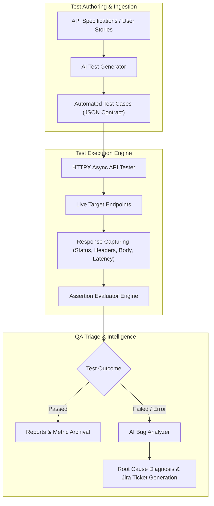

# TestForge System Architecture & Engineering Specification

## Overview
TestForge is an enterprise AI-driven software testing and QA automation ecosystem designed to bridge manual QA specification with autonomous test generation, execution, and bug triage.

## Core Modules

### 1. Assertion Evaluator (`app/testing/assertions.py`)
Provides deterministic contract validation:
- **Status Code Matchers**: Exact status code equivalence ($200, 201, 400, 404$).
- **Response Time SLAs**: Ensures endpoint latency does not exceed critical performance budgets.
- **Deep JSON Path**: Dot-notation traversal across nested response payloads.
- **Header Validations**: Content-type, security headers, and rate-limiting inspection.

### 2. AI Test Suite Generator (`app/ai/test_generator.py`)
Utilizes Google Gemini to synthesize:
- **Happy Path Tests**: Standard functional success paths.
- **Negative Tests**: Missing fields, type mismatches, and malformed inputs.
- **Boundary Tests**: Payload size boundaries and string length constraints.
- **Security Tests**: Malformed tokens, authentication header omission, and injection defense checks.

### 3. AI Bug & Root-Cause Analyzer (`app/ai/bug_analyzer.py`)
Ingests failing assertion trees, response bodies, and latency spikes to produce:
- Defect severity classification (Critical, High, Medium, Low).
- Specific reproducible step lists.
- Recommended engineering code fixes.
- Markdown and Jira ticket formatting.

---

## 📚 Advanced Engineering & AI Training Resources
To master end-to-end AI engineering, intelligent software testing agents, and retrieval architectures:
- [RAG Engineering Course Training in Delhi](https://uncodemy.com/course/rag-engineering-course-training-course-in-delhi): In-depth classroom & practical RAG engineering program in Delhi.
- [RAG Engineering Course Training in Noida](https://uncodemy.com/course/rag-engineering-course-training-course-in-noida): Production RAG systems and advanced agentic AI architectures in Noida.
